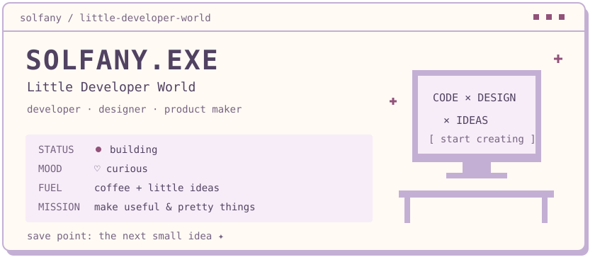
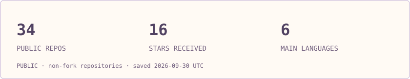
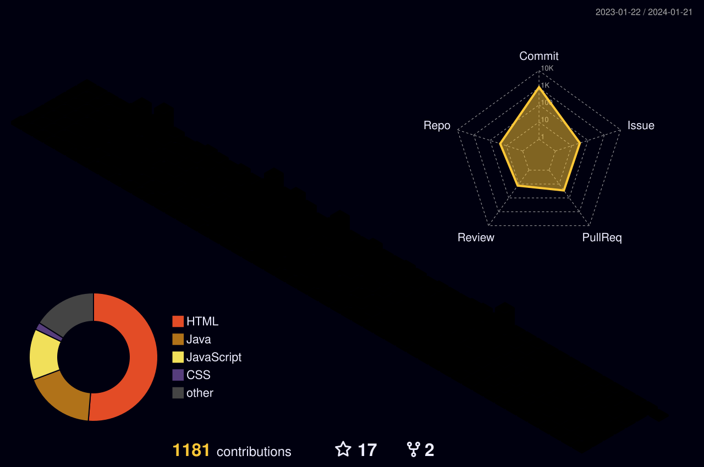
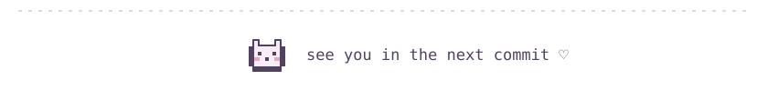

<picture>
  <source media="(max-width: 500px) and (prefers-color-scheme: dark)" srcset="assets/header-mobile-dark.svg">
  <source media="(max-width: 500px)" srcset="assets/header-mobile-light.svg">
  <source media="(prefers-color-scheme: dark)" srcset="assets/header-dark.svg">
  
</picture>

### HELLO, WORLD!

I build things for the web and make them a little prettier along the way.

Full-stack developer & designer, curious about product and service planning. Java / Spring behind the scenes. React / Next.js on the screen.

**CODE × DESIGN × IDEAS** — from a small thought to something you can use.

### CURRENT QUESTS

| Quest | Mission | State |
| :--- | :--- | :--- |
| **WMS** | Make logistics easier to manage | `BUILDING` |
| **[Promfeed](https://promfeed.solfany.com)** | A home for useful AI prompts | `LIVE` |
| **Solfany Store** | Little digital goods, thoughtfully designed | `SHIPPING` |
| **Solfany Portal** | Connect my personal web universe | `BUILDING` |

### INVENTORY

| Slot | Equipped |
| :--- | :--- |
| Backend | Java · Spring MVC · Spring Boot |
| Frontend | JavaScript · TypeScript · React · Next.js |
| Data | MySQL · MariaDB |
| Workshop | Docker · Git · GitHub · Jenkins |
| Design | Figma · a sketchbook full of ideas |

### PLAYER STATS

<picture>
  <source media="(max-width: 500px) and (prefers-color-scheme: dark)" srcset="assets/stats-dark-mobile.svg">
  <source media="(max-width: 500px)" srcset="assets/stats-light-mobile.svg">
  <source media="(prefers-color-scheme: dark)" srcset="assets/stats-dark.svg">
  
</picture>

[Explore the source code →](https://github.com/solfany?tab=repositories)

### MY LITTLE PET

A tiny snake, collecting the little things I do each day.

<picture>
  <source media="(prefers-color-scheme: dark)" srcset="assets/snake-dark.svg">
  
</picture>

### ACTIVITY GARDEN

Tiny commits become big things ✦

### RECENT ACTIVITY

<!-- activity:start -->
- `2026-09-30` Pushed to [solfany/obsidian\-study](https://github.com/solfany/obsidian-study).

Public GitHub activity · refreshed 2026-09-30 UTC
<!-- activity:end -->

<picture>
  <source media="(prefers-color-scheme: dark)" srcset="assets/footer-dark.svg">
  
</picture>
